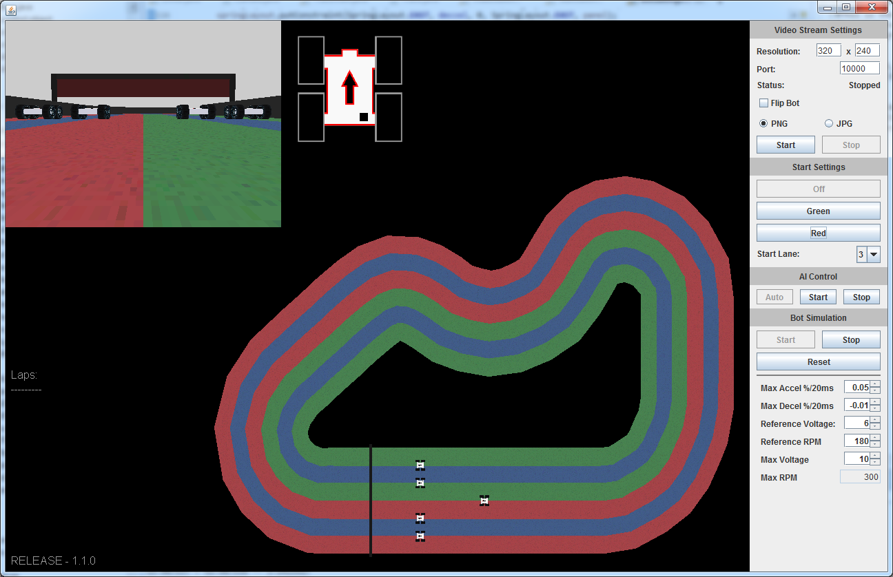

# FormulaPiSim

First Generation Simulator for FormulaPi

### Requirements:
+ JDK 1.8+
+ Maven 3.3+

### Building:
+ Run `mvn package`
+ Compiled runnable jar will be generated into `target\FormulaPiSim-1.2-Snapshot.jar`
+ Compressed distribution packages `[zip|tar.gz|tar.bz2]` are also generated in the `target` folder

### Running / Usage
+

### TODO:
+ JOGL Classpath Linking (DLL's are not being loaded properly from jar classpath)
+ Update Motor settings to have selection between MonsterBorg and YetiBorg presets
+ Upgrade to RTP/RTSP streaming 

### 1.2.0 Updates:
+ Converted to Maven for Dependency / Build Management
+ Tweaked StaticImageStreams to reduce Output lag
